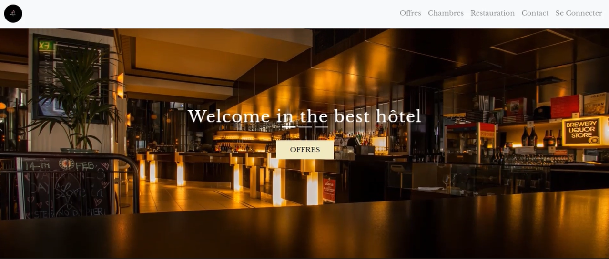

# Hostel App

## Vidéo de démonstration

Cliquez sur l'image ci-dessus pour regarder la vidéo de démonstration de l'application Hostel.

### Clients

L'application Hostel App est conçue pour simplifier la réservation d'un hôtel et fournir un système de calcul des prix pour chaque service. Les clients peuvent consulter les différentes offres de l'hôtel et créer un compte pour suivre leurs transactions pendant leur séjour.

### Admin (Directeurs)

Hostel App permet aux directeurs d'hôtel d'avoir une vue d'ensemble de toutes les données de leur établissement et de gérer les factures. Les directeurs peuvent également accéder aux statistiques mensuelles, gérer les employés et offrir un service de qualité à leurs clients.

Pour accéder au compte admin :

- Email : Admin@Admin.com
- Mot de passe : 123

### Technologies utilisées

Les langages et technologies utilisés pour le développement de l'application sont :

-  HTML
-  CSS
-  JavaScript
-  PHP
-  Bootstrap
-  jQuery
-  DataTables
-  MySQL
